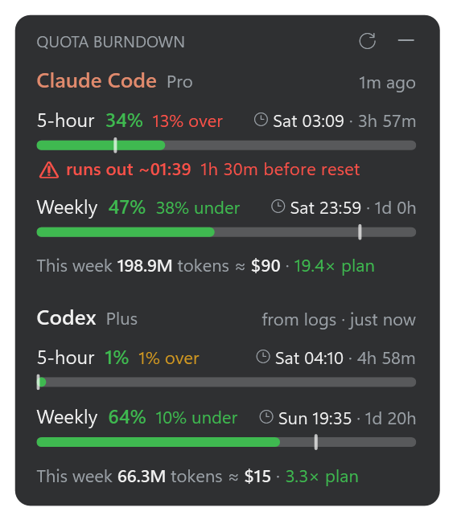
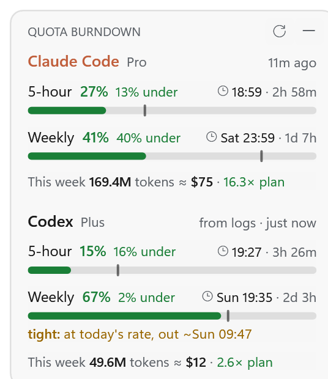
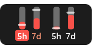

# Quota Burndown

**A burndown chart for your Claude Code and Codex limits.**

<br clear="left">

A small Windows desktop widget and taskbar strip that show your **Claude Code** and **OpenAI Codex** usage limits for the **5-hour** and **weekly** windows. For each window it also shows:

- your pace,
- when you'll run out at your current rate,
- how many tokens you've burned,
- what those tokens would have cost on the pay-as-you-go API.

It's a single PowerShell script. There's nothing to install and no dependencies: it runs on the Windows PowerShell 5.1 that ships with Windows 10 and 11.

<p>
  
  
</p>

Taskbar strip: 

> **Unofficial.** This project is not affiliated with or endorsed by Anthropic or OpenAI. It reads the same usage data that Claude Code's `/usage` command and the Codex CLI use internally. Those endpoints are undocumented and may change at any time.

## Features

- **Desktop widget.** Compact by design: two lines per window, with the details on hover.
  - **Each window:** % used, how far over or under the even pace you are (e.g. "9% under"), and when it resets (e.g. "🕒 Sun 19:35 · 2d 3h", shown with a clock icon). Below that is a bar whose white tick marks where an even pace would put you.
  - **Run-out warning:** appears only when it matters, based on your recent burn rate (the last hour for the 5-hour window, today for the weekly one):
    - **Red:** you're over the even pace *and* will run out well before the reset, e.g. "⚠ runs out ~17:21, 2h 38m before reset".
    - **Amber "tight":** you'd run out only shortly before the reset, or you're still under the even pace, e.g. "tight: at today's rate, out ~Sun 13:11".
  - **One summary line per tool:** this week's tokens burned (from local logs), what they'd cost at API list prices, and how that compares with your plan, e.g. "This week 163.8M tokens ≈ $74 · 16.0× plan".
  - **Hover over a row** for the even-pace %, the forecast ("~61% by reset"), its burn rate, the reset date, and the token breakdown (input / output / cache write / cache read).
- **Taskbar strip.** Four tiny signal bars sit next to the tray icons:
  - **5h** is the 5-hour window and **7d** is the weekly window. Orange labels are Claude Code, white labels are Codex.
  - Red means used and grey means remaining. The white line is the even pace.
  - A red label pill means that window will run out before it resets. An amber outline means it's tight.
  - Click the strip to show or hide the widget, and drag it to move it along the taskbar.
- **Tray icon.** The app logo, with all four numbers in its tooltip. Click it to show or hide the widget, or right-click it for the menu.
- **Usage history.** Every reading is appended to `history.csv`, ready for Excel or Power BI.
- **Themes.** Follows the Windows light/dark theme, and the strip follows the taskbar's theme.
- **Hides itself** when a fullscreen app is in front or the taskbar is auto-hidden.

## Requirements

- Windows 10 or 11.
- **Claude Code**, signed in with a Claude subscription (Pro or Max), for the Claude Code numbers.
- **Codex**, signed in with ChatGPT (the Codex desktop app, or the CLI from npm or elsewhere on `PATH`), for the Codex numbers.

Either one alone is fine; the other section just shows "not found".

## Install

Pick one. All three end with the same result: the script in `%USERPROFILE%\.quota-burndown`, **Quota Burndown** in the Start menu, and the widget running.

### Option 1: zip with a double-click installer

1. From the [latest release](https://github.com/mondrikrob/quota-burndown/releases/latest), download `QuotaBurndown-<version>.zip`.
2. Optional, but a good habit: [check its SHA-256](#verify-the-download).
3. Extract the zip, then double-click **`Install.cmd`**. Windows may warn that the file came from the internet; choose **Run**. The installer:
   - runs `Unblock-File` on the `QuotaBurndown.ps1` next to it,
   - then runs `QuotaBurndown.ps1 -Install`.

   That's all it does; open it in Notepad to check.

### Option 2: Scoop

If you use [Scoop](https://scoop.sh), this repository is also a Scoop bucket. The manifest pins the release URL and its SHA-256, so Scoop refuses a file that doesn't match.

```powershell
scoop bucket add quota-burndown https://github.com/mondrikrob/quota-burndown
scoop install quota-burndown/quota-burndown
QuotaBurndown -Install
```

To update, run `scoop update quota-burndown`, then `QuotaBurndown -Install` again.

### Option 3: just the script

1. Download `QuotaBurndown.ps1` from the [latest release](https://github.com/mondrikrob/quota-burndown/releases/latest) (or clone this repository) and read it. It's one file, and it's meant to be readable.
2. Unblock it (files downloaded from the internet are marked), then install:

   ```powershell
   Unblock-File .\QuotaBurndown.ps1
   powershell -NoProfile -ExecutionPolicy Bypass -File .\QuotaBurndown.ps1 -Install
   ```

   Run the same command again after updating the script.

### After installing

The first install asks two yes/no questions (both default to **no**, and both can be changed later in the menu):
- **Renew the Claude Code login automatically?** See [Claude login renewal](#claude-login-renewal) below.
- **Check for new versions once a day?** The widget then asks GitHub for the latest version number and shows a link if there's a newer one. Nothing is downloaded or installed automatically.

Optional: right-click the widget and choose **Start with Windows**.

`-ExecutionPolicy Bypass` only applies to that one PowerShell process; it doesn't change your system policy. The Start menu shortcut launches the script through `conhost --headless`, so no console window appears.

There are deliberately no `irm ... | iex` one-liners: you always get a file you can read and check before running it. The script isn't code-signed (a certificate costs money); the SHA-256 checksums are the way to make sure you got the published file.

### Verify the download

Each release lists the SHA-256 of every file in its notes and in `SHA256SUMS.txt`. Compare them with:

```powershell
Get-FileHash .\QuotaBurndown-1.3.1.zip -Algorithm SHA256
```

The hash must match exactly (`Get-FileHash` prints it in upper case; case doesn't matter).

## Using it

**Widget**
- **Move:** drag it.
- **Refresh:** double-click it, or use the refresh button.
- **Minimize:** the minimize button hides it so only the taskbar strip remains.

**Right-click menu** (on the widget, the strip or the tray icon)
- Show/Hide widget
- Refresh now
- Always on top
- Show on taskbar
- Reset taskbar position
- Start with Windows
- Renew Claude login automatically
- Check for updates daily
- Update available (only when there is one; opens the release page)
- Open data folder
- Exit

**Command line**

| Command | What it does |
|---|---|
| `QuotaBurndown.ps1 -Once` | Print the current numbers to the console and exit |
| `QuotaBurndown.ps1 -Snapshot out.png [-Theme dark\|light]` | Render the widget (and `out-strip.png`) to images |
| `QuotaBurndown.ps1 -Uninstall` | Stop the widget and remove its shortcuts and installed copy |

## How it works

| What | Source | How often |
|---|---|---|
| Claude Code limits | `GET https://api.anthropic.com/api/oauth/usage` with the OAuth token Claude Code stores in `~/.claude/.credentials.json` | every 15 min (cached on disk; honors `Retry-After`) |
| Codex limits | `codex app-server --stdio` → JSON-RPC `account/rateLimits/read`. If that fails, it falls back to the `rate_limits` entries in `~/.codex/sessions/**/*.jsonl` | every 3 min |
| Tokens burned | Parsed from `~/.claude/projects/**/*.jsonl` and `~/.codex/sessions/**/*.jsonl` (read incrementally) | every minute |
| Run-out forecast | Your burn rate from `history.csv`: the last hour for the 5-hour window, the last 24 h for the weekly one. If there isn't enough history yet, it uses the average since the window started | every minute |
| API value | Tokens × API list prices per model (table near the top of the data layer in the script) | every minute |

Notes:

- **The Claude usage endpoint rate-limits aggressively.** A 429 can lock you out for about an hour, so don't set `ClaudeRefreshMinutes` below 10.
- **Token counts only cover what's logged on this PC.** The % limits also include claude.ai chats, Codex in ChatGPT on the web and other devices. So a window can show a % used with few or zero local tokens, and the API value is a lower bound.
- **API value is an estimate.** It uses list prices and ignores long-context surcharges, batch discounts and so on.

## Claude login renewal

Claude Code's login on your PC (in `~/.claude/.credentials.json`) lasts about 8 hours. The `claude` CLI renews it whenever you run it, but the Claude desktop app never does. So if you mostly use the desktop app, the widget will at some point show **login expired**. You have two options:

- **Run `claude` once** in a terminal (and exit it). This is the default, and it's what the widget asks you to do.
- **Let the widget renew it.** Answer yes at install, or tick **Renew Claude login automatically** in the menu. The widget then renews the login the way Claude Code does and writes the new tokens back. It changes only those fields and writes the file atomically.

  This is unofficial: the widget presents itself to Anthropic's login server as Claude Code, which may stop working and could be considered against Anthropic's terms. Details in [SECURITY.md](SECURITY.md#automatic-login-renewal-opt-in).

## Settings

Stored in `%USERPROFILE%\.quota-burndown\settings.json`. Restart the widget after editing (Exit, then reopen it from the Start menu).

| Setting | Default | |
|---|---|---|
| `ClaudeRefreshMinutes` | `15` | Minimum 5; keep it at 10 or more |
| `CodexRefreshMinutes` | `3` | |
| `ClaudePlanUsdPerMonth` | auto | Overrides the detected plan price (Pro $20, Max 5x $100, Max 20x $200) |
| `CodexPlanUsdPerMonth` | auto | Overrides the detected plan price (Plus $20, Pro $200) |
| `ClaudeAutoRenewLogin` | asked at install (off) | Renew an expired Claude Code login; also in the menu |
| `CheckForUpdates` | asked at install (off) | Look for a newer release once a day; also in the menu |
| `Topmost`, `Visible`, `StripVisible` | `true` | Also available from the menu |
| `StripOffset` | `8` | Gap between the strip and the tray icons; drag the strip to change it |
| `Left`, `Top` | saved automatically | Widget position |

## Files

Everything lives in `%USERPROFILE%\.quota-burndown`. It's kept outside AppData on purpose: packaged (Store/MSIX) apps virtualise AppData writes.

| File | Contents |
|---|---|
| `QuotaBurndown.ps1` | Installed copy of the script |
| `settings.json` | Your settings |
| `claude-usage.json` | Last Claude usage response, so restarts don't re-query the rate-limited endpoint |
| `update-check.json` | When the update check last ran and the latest version it saw (only if the check is on) |
| `history.csv` | Every usage reading: `timestamp_utc, tool, window, used_percent, resets_at_utc` |
| `widget.log` | Errors and warnings (rotated at 512 KB) |
| `quota-burndown.ico` | The logo, used for the tray icon and shortcuts (regenerated on start) |

## Privacy and security

See [SECURITY.md](SECURITY.md). In short:

- The only network traffic is to `api.anthropic.com`, plus whatever the Codex CLI itself does to fetch your limits. If you turn on the update check, it also asks `api.github.com` once a day for the latest version number.
- The Claude OAuth tokens are read from Claude Code's own file and sent only to `api.anthropic.com` over HTTPS. They're never written anywhere else or logged. Only if you turn on automatic login renewal does the widget write renewed tokens back to that same file.
- There is no telemetry.

## Troubleshooting

- **"login expired":** the Claude Code login on this PC has expired. Run `claude` once in a terminal, or turn on **Renew Claude login automatically** in the menu.
- **"sign in needed":** Claude Code's saved login can't be renewed (for example, you signed out, or the refresh token was used elsewhere). Run `claude auth login` in a terminal; the widget picks up the new login within a minute.
- **"login expired" with a retry time** (automatic renewal on): renewal was rate-limited. The widget retries on its own; hover over the status for the next attempt time.
- **"rate limited":** the Claude usage endpoint asked to wait. The widget keeps showing the last values and retries after the requested time.
- **Codex "not found":** install the Codex desktop app, or make sure `codex.exe` is on `PATH`.
- **Codex shows "from logs":** the live query failed; you're seeing the latest values recorded in your Codex session logs.
- **Nothing on the taskbar:** check **Show on taskbar** in the menu. The strip hides when the taskbar is auto-hidden or vertical, and when a fullscreen app is in front.
- **Anything else:** check `widget.log` (menu → **Open data folder**).

## Uninstall

```powershell
powershell -NoProfile -ExecutionPolicy Bypass -File "$env:USERPROFILE\.quota-burndown\QuotaBurndown.ps1" -Uninstall
```

If you installed with Scoop, also run `scoop uninstall quota-burndown`.

This removes the shortcuts and the installed copy. Delete `%USERPROFILE%\.quota-burndown` to remove settings and history too.

## Tested on

| | |
|---|---|
| Windows | Windows 11 (ARM64) |
| PowerShell | Windows PowerShell 5.1 for the widget; the automated tests also run on PowerShell 7 |
| Taskbar | at the bottom, dark theme, single monitor |

Not tested yet: Windows 10, x64 PCs for the widget itself (the automated tests run on x64), a taskbar on a second monitor, a light taskbar on a real screen (only in rendered previews), and top or side taskbars (the strip hides itself when the taskbar is vertical). Reports are welcome.

## Development

`tests\` holds [Pester](https://pester.dev) 5 tests for the parts that matter most for safety and correctness: the credentials-file update, settings validation, the `history.csv` sanitiser and the forecast levels. GitHub Actions runs them on every push, on Windows PowerShell 5.1 and PowerShell 7, together with a parse check and [PSScriptAnalyzer](https://github.com/PowerShell/PSScriptAnalyzer) (`PSScriptAnalyzerSettings.psd1` lists the excluded style rules and why).

```powershell
Invoke-Pester -Path .\tests
```

Releases are built with `tools\Build-Release.ps1 -Version x.y.z` (PowerShell 7). It creates the zip and `SHA256SUMS.txt` in `dist\` and pins the new hash in the Scoop manifest (`bucket\quota-burndown.json`).

## License

[MIT](LICENSE). Claude and Claude Code are trademarks of Anthropic; Codex and ChatGPT are trademarks of OpenAI.
